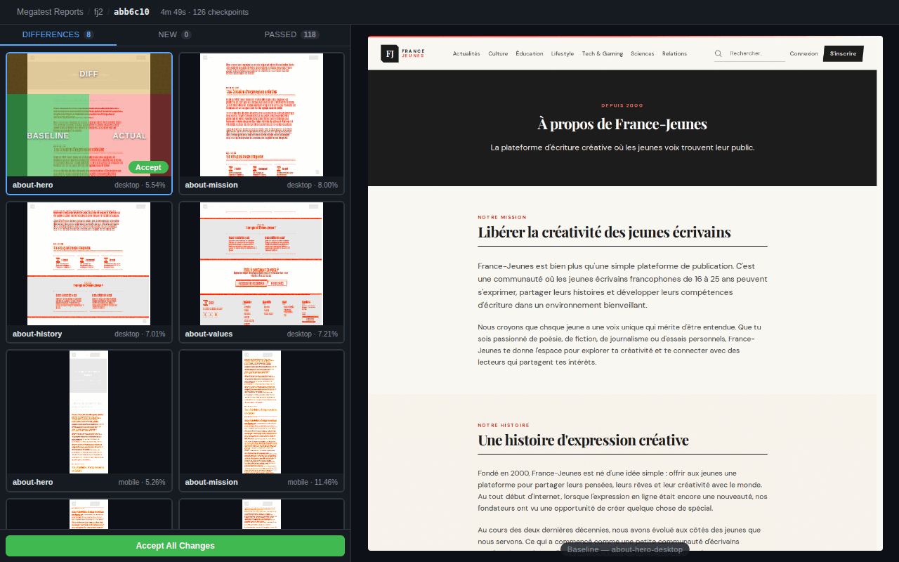

# Megatest



Local-first visual regression testing. Megatest takes screenshots of your web app, compares them against baselines, and generates a standalone HTML report showing what changed.

It has two parts:

1. **A CLI** that runs Playwright workflows, diffs screenshots with pixelmatch, and produces reports
2. **A Claude Code skill** (`/megatest`) that auto-generates test configs by browsing your live site

## Quick Start

### 1. Install

```bash
cd cli
npm install
npm run build
npx playwright install chromium
```

### 2. Set up Claude Code (for the `/megatest` skill)

Install [Claude Code](https://docs.anthropic.com/en/docs/claude-code) if you haven't already, then add the Playwright MCP server globally so the `/megatest` skill can browse your live site:

```bash
claude mcp add -s user playwright -- npx @playwright/mcp@latest
```

Then launch Claude Code from the megatest directory:

```bash
claude
```

### 3. Create a `.megatest/` config in your project

Either write it by hand (see [Config Format](#config-format) below) or use the Claude Code skill:

```
/megatest ../my-project http://localhost:3000
```

### 4. Run tests

```bash
node cli/bin/megatest.js run --repo ../my-project --url http://localhost:3000
```

First run: all screenshots are "new" (no baselines yet). A report is generated at `.megatest/reports/<commit>/index.html`.

### 5. Accept baselines

```bash
node cli/bin/megatest.js accept --repo ../my-project
```

This promotes the current screenshots to baselines. Commit the `baselines/` directory.

### 6. Run again after changes

```bash
node cli/bin/megatest.js run --repo ../my-project --url http://localhost:3000
```

Screenshots are compared against baselines. Diffs above the threshold are reported as failures.

## CLI Commands

### `megatest run`

Run visual regression tests.

```
megatest run --repo <path> --url <url> [--plan <name>] [--workflow <name>]
```

| Flag | Description |
|------|-------------|
| `--repo <path>` | Path to the target repository (required) |
| `--url <url>` | Base URL of the running application (required) |
| `--plan <name>` | Run only workflows listed in a specific plan |
| `--workflow <name>` | Run a single workflow |

**Workflow resolution order:**
- `--workflow` flag: run only that workflow
- `--plan` flag: run workflows listed in that plan file
- No flag + `plans/default.yml` exists: use the default plan
- No flag + no default plan: run all workflows

**What it does:**
1. Loads and validates `.megatest/` config
2. Launches headless Chromium via Playwright
3. Runs each workflow across all configured viewports
4. Saves screenshots to `.megatest/actuals/`
5. Compares against baselines in `.megatest/baselines/`
6. Generates an HTML report at `.megatest/reports/<commit>/index.html`
7. Prints a console summary

**Exit codes:** 0 = all pass, 1 = any failures/new/errors.

### `megatest validate`

Validate the `.megatest/` configuration without running tests.

```
megatest validate --repo <path>
```

Checks all YAML files for:
- Valid syntax and structure
- Filename/name field consistency
- No duplicate workflow or include names
- All include references resolve
- No circular includes
- All plan workflow references exist

### `megatest accept`

Promote screenshots from the latest run to baselines.

```
megatest accept --repo <path>                   # Accept all
megatest accept login-form --repo <path>        # Accept one checkpoint (all viewports)
```

Copies PNGs from `.megatest/actuals/` to `.megatest/baselines/` and removes the originals.

## Config Format

All config lives in a `.megatest/` directory in your project root.

```
.megatest/
  config.yml              # Global settings
  workflows/              # One YAML file per test flow
    homepage.yml
    login.yml
  includes/               # Optional: reusable step sequences
    login.yml
  plans/                  # Optional: named subsets of workflows
    default.yml
    smoke.yml
  baselines/              # Golden screenshots (commit to git)
  reports/                # Generated reports (gitignored)
  actuals/                # Current run screenshots (gitignored)
  .gitignore
```

### config.yml

```yaml
version: "1"
defaults:
  viewport: { width: 1280, height: 720 }
  threshold: 0.1              # max % of pixels that can differ (0.0-100.0)
  waitAfterNavigation: "1000" # "load", "networkidle", or milliseconds
  screenshotMode: viewport    # "viewport" or "full"
  timeout: 30000              # per-step timeout in ms
viewports:
  desktop: { width: 1280, height: 720 }
  mobile: { width: 375, height: 812 }
variables:
  TEST_USER: test@example.com
  TEST_PASS: testpass123
```

All fields have sensible defaults. A minimal `config.yml` is just:

```yaml
version: "1"
```

### Workflow files

Each file in `workflows/` defines a test flow. The filename must match the `name` field and use only `[a-z0-9-]` characters.

```yaml
# workflows/login.yml
name: login
description: Tests the login flow
steps:
  - open: /login
  - wait: 500
  - screenshot: login-page-empty
  - fill: { label: "Email", text: "${TEST_USER}" }
  - fill: { label: "Password", text: "${TEST_PASS}" }
  - screenshot: login-page-filled
  - click: { role: "button", name: "Sign in" }
  - wait: 1000
  - screenshot: login-success
```

### Step types

| Step | Example | What it does |
|------|---------|-------------|
| `open` | `open: /about` | Navigate to a URL path (relative to `--url`) |
| `wait` | `wait: 500` | Wait N milliseconds |
| `screenshot` | `screenshot: hero-section` | Take a screenshot checkpoint |
| `click` | `click: { role: "button", name: "Submit" }` | Click an element |
| `fill` | `fill: { label: "Email", text: "me@x.com" }` | Type into a form field |
| `hover` | `hover: { testid: "dropdown" }` | Hover over an element |
| `select` | `select: { label: "Country", value: "FR" }` | Pick a dropdown option |
| `press` | `press: "Enter"` | Press a keyboard key |
| `scroll` | `scroll: { down: 500 }` | Scroll the page (up/down/left/right) |
| `eval` | `eval: "document.body.style.background='red'"` | Run arbitrary JavaScript |
| `include` | `include: login` | Insert steps from an include file |
| `set-viewport` | `set-viewport: mobile` | Change viewport mid-workflow |

### Locators

Steps like `click`, `fill`, `hover`, and `select` target elements using locators. Use the most stable option available:

```yaml
# Best — uses data-testid attribute
click: { testid: "submit-btn" }

# Good — uses ARIA role and accessible name
click: { role: "button", name: "Sign in" }

# Good — uses associated <label>
fill: { label: "Email address", text: "me@x.com" }

# OK — uses visible text content
click: { text: "Get Started" }

# OK — uses placeholder text
fill: { placeholder: "Search...", text: "query" }

# Last resort — CSS selector
click: { css: ".header > nav > a:nth-child(2)" }
```

### Variables

Reference variables in step string values with `${VAR_NAME}`:

```yaml
# From config.yml variables section:
fill: { label: "Email", text: "${TEST_USER}" }

# From environment variables:
fill: { label: "API Key", text: "${env:API_KEY}" }
```

### Include files

Extract repeated steps (like login) into `includes/`:

```yaml
# includes/login.yml
name: login
steps:
  - open: /login
  - fill: { label: "Email", text: "${TEST_USER}" }
  - fill: { label: "Password", text: "${TEST_PASS}" }
  - click: { role: "button", name: "Sign in" }
  - wait: 1000
```

Then reference from any workflow:

```yaml
steps:
  - include: login
  - open: /dashboard
  - screenshot: dashboard-main
```

### Plan files

Plans define named subsets of workflows:

```yaml
# plans/smoke.yml
name: smoke
description: Quick smoke test
workflows:
  - homepage
  - login
```

```yaml
# plans/default.yml
name: default
description: All tests
workflows:
  - homepage
  - login
  - dashboard
  - settings
```

## HTML Report

Each run generates a standalone HTML report at `.megatest/reports/<commit>/index.html`. Open it directly in a browser — no server needed.

The report shows:
- **Failed checkpoints** expanded with side-by-side Baseline / Actual / Diff images
- **New checkpoints** (no baseline) expanded with the Actual screenshot
- **Passed checkpoints** collapsed in a summary card
- **Filter chips** to show All / Failed / New / Passed

The report uses a GitHub-style dark theme.

## Screenshot Naming

Screenshots are named `<checkpoint>-<viewport>.png`. For example, a workflow with `screenshot: hero-section` run against the `desktop` and `mobile` viewports produces:

```
hero-section-desktop.png
hero-section-mobile.png
```

## Claude Code Skill

If you use [Claude Code](https://docs.anthropic.com/en/docs/claude-code), the `/megatest` skill auto-generates `.megatest/` config by browsing your live site with Playwright MCP.

**Prerequisite:** Add the Playwright MCP server globally (one-time setup):

```bash
claude mcp add -s user playwright -- npx @playwright/mcp@latest
```

Then from within a Claude Code session:

```
/megatest ../my-project http://localhost:3000
```

**Bootstrap mode** (no existing config): creates the full `.megatest/` directory with config, workflows, includes, and a default plan.

**Incremental mode** (config exists): reads `git diff` since the last plan update, browses only affected pages, and adds new workflow files without modifying existing ones.

## Example Workflow

A typical session for a project at `../my-app` running on `http://localhost:3000`:

```bash
# Generate config (Claude Code skill)
# /megatest ../my-app http://localhost:3000

# Or create .megatest/ manually, then validate
node cli/bin/megatest.js validate --repo ../my-app

# First run — establishes initial screenshots
node cli/bin/megatest.js run --repo ../my-app --url http://localhost:3000

# Accept all as baselines
node cli/bin/megatest.js accept --repo ../my-app

# Commit baselines to git
cd ../my-app && git add .megatest/baselines .megatest/config.yml .megatest/workflows .megatest/plans

# Make changes to your app, then re-run
node cli/bin/megatest.js run --repo ../my-app --url http://localhost:3000

# Review the report, then accept intentional changes
node cli/bin/megatest.js accept hero-section --repo ../my-app
```
